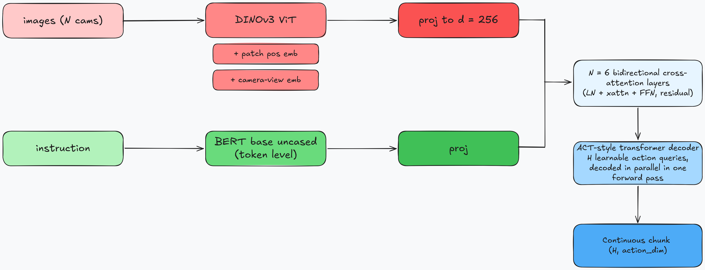

# lerobot_policy_turbovla_so101

<p align="left">
  <a href="https://pypi.org/project/lerobot-policy-turbovla-so101/"></a>
  <a href="https://pypi.org/project/lerobot-policy-turbovla-so101/"></a>
  <a href="https://github.com/ravediamond/lerobot-policy-turbovla-so101/actions/workflows/ci.yml"></a>
  <a href="https://github.com/ravediamond/lerobot-policy-turbovla-so101/blob/main/LICENSE"></a>
  <a href="https://arxiv.org/abs/2607.27205"></a>
</p>

TurboVLA as a standalone [LeRobot](https://github.com/huggingface/lerobot) policy plugin — trained
and validated end-to-end on a real [SO-101](https://github.com/TheRobotStudio/SO-ARM100) arm, not
just simulation.

```bash
lerobot-train --policy.type=act              ...   # before
lerobot-train --policy.type=turbovla_so101   ...   # after
```

Everything else in the workflow — record, train, rollout — stays identical. This registers a
policy and lets `lerobot-train` drive it; no fork of LeRobot itself, no custom harness.

## Contents

- [Why TurboVLA instead of ACT](#why-turbovla-instead-of-act)
- [Architecture](#architecture)
- [Install](#install)
- [Train](#train)
- [Configuration](#configuration)
- [Results](#results)
- [Dataset requirements](#dataset-requirements)
- [Benchmarks and evaluation](#benchmarks-and-evaluation)
- [Tests](#tests)
- [Citation](#citation)
- [Attribution](#attribution)
- [License](#license)

## Why TurboVLA instead of ACT

Same ergonomics as ACT (chunked continuous actions, parallel decode, L1 loss), but language
conditioned:

|                 | ACT                    | TurboVLA                            |
| --------------- | ---------------------- | ------------------------------------ |
| Language        | none                   | BERT token-level, fused into vision  |
| Visual backbone | ResNet18                | DINOv3 ViT-B                        |
| Action decode   | parallel chunk queries  | parallel chunk queries (same idea)  |
| Params          | ~80M                    | ~0.2B                                |

The practical win on a multi-task arm dataset: ACT ignores the task string, so you need one
checkpoint per task. TurboVLA conditions on it, so one checkpoint can cover many tasks in the same
dataset.

Upstream research code: <https://github.com/H-EmbodVis/TurboVLA>; paper
[arXiv:2607.27205](https://arxiv.org/abs/2607.27205). Only the modules were ported here, not the
harness. The upstream is built around its own trainer, TFDS/RLDS for LIBERO, and a `flash-attn`
dependency this package avoids.

## Architecture



Important things:

- **Bidirectional fusion.** Both directions run every layer: vision→text injects scene context,
  text→vision conditions patch features on task semantics. Both read the same pre-update snapshot,
  so the updates are simultaneous rather than chained. The paper's ablation puts bidirectional at
  97.7% against 96.1–96.5% for one-way.
- **Token-level language**, not a pooled sentence embedding — that is what preserves object,
  attribute and spatial-relation grounding.
- **Camera-view embeddings** distinguish which camera a patch came from, needed as soon as there is
  more than one camera.
- **Plain L1** on the action chunk. No VAE and no KL term, so ACT's `use_vae` / `latent_dim` /
  `kl_weight` have no analogue here.
- All attention goes through `torch.nn.functional.scaled_dot_product_attention`. No `flash-attn`.

## Install

Requires Python ≥ 3.12.

```bash
pip install lerobot_policy_turbovla_so101
```

`lerobot` and `transformers` come along as dependencies, and `--policy.type=turbovla_so101`
works immediately — see [Train](#train).

### If you are on a torch build pip cannot reproduce

A ROCm build, a nightly, or a source build. pip cannot re-fetch that torch from PyPI, and `lerobot`
pins `torch<2.12.0` — so a torch outside that range does not satisfy the pin, and a plain install
**uninstalls your build and drops a CUDA wheel in its place**, along with ~4 GB of `nvidia-*`
packages. Install the packages that pin torch with `--no-deps`, and let the rest resolve normally.

```bash
# 1. the three packages that pin torch — installed without their dependency graph
pip install --no-deps lerobot torchcodec lerobot_policy_turbovla_so101

# 2. lerobot's remaining dependencies, which are harmless. Derive the list rather
#    than transcribing it, so it stays correct across lerobot versions:
python - <<'EOF' > /tmp/deps.txt
from importlib.metadata import requires
from packaging.requirements import Requirement
skip = {"torch", "torchvision", "torchcodec", "triton"}
for r in requires("lerobot") or []:
    req = Requirement(r)
    if (req.marker and not req.marker.evaluate()) or req.name.lower() in skip:
        continue
    print(req)
EOF
pip install -r /tmp/deps.txt "transformers>=5.4.0,<5.6.0"

# 3. confirm your torch survived
python -c "import torch; print(torch.__version__)"
```

pip then prints a dependency-conflict warning about `torch<2.12.0`. It is advisory; the policy
runs fine on newer torch.

To make this durable, pin torch in a constraints file so any future pip command in the
environment fails loudly instead of replacing it:

```bash
python -c "import torch, torchvision; print(f'torch=={torch.__version__}\ntorchvision=={torchvision.__version__}')" \
  > ~/.config/pip/torch-constraints.txt
export PIP_CONSTRAINT=~/.config/pip/torch-constraints.txt
```

To work on the package itself, `pip install -e ".[test]"` from a clone.

Verify discovery:

```bash
python -c "
from lerobot.utils.import_utils import register_third_party_plugins
from lerobot.configs import PreTrainedConfig
register_third_party_plugins()
assert 'turbovla_so101' in PreTrainedConfig.get_known_choices()
print('ok')"
```

The distribution name must stay `lerobot_policy_turbovla_so101`.

### The DINOv3 weights are gated

The default `facebook/dinov3-vitb16-pretrain-lvd1689m` is a **gated** repo. Accept the terms on the
model page, then authenticate:

```bash
hf auth login          # or: export HF_TOKEN=...
```

Without that you get a 401 at model construction. Two ways around it:

```bash
# 1. Use an ungated backbone instead (any patch-based ViT that AutoModel can load).
--policy.vision_backbone=facebook/dinov2-base

# 2. Skip pretrained weights entirely — random init for smoke tests only.
--policy.load_pretrained_backbones=false
```

## Train

### Local

```bash
lerobot-train \
  --dataset.repo_id=${HF_USER}/so101_pickplace \
  --policy.type=turbovla_so101 \
  --policy.device=cuda \
  --batch_size=64 \
  --steps=80000 \
  --output_dir=outputs/train/turbovla_so101 \
  --job_name=turbovla_so101 \
  --wandb.enable=true
```

Point `--dataset.repo_id` at any community LeRobot dataset to smoke-test the policy before a robot
is involved.

### Multi-GPU

`lerobot-train` supports `torchrun --nproc_per_node=N`, and `--batch_size` is then per rank (two
ranks at 128 give the global 256 of the paper's LIBERO recipe). Nothing in this policy is
single-device specific.

Be aware that multi-GPU needs working GPU collectives (NCCL/RCCL), which are a property of your
PyTorch build rather than of this package. Verify with a bare all-reduce before committing to a long
run. If that fails, so will any distributed training, for any policy. Single-GPU training is
unaffected; raise `--batch_size` to reach a comparable effective batch.

### Hugging Face Jobs

Nothing in this package is ROCm-specific, so the identical command runs on a rented NVIDIA box:

```bash
lerobot-train \
  --dataset.repo_id=${HF_USER}/so101_pickplace \
  --policy.type=turbovla_so101 \
  --policy.repo_id=${HF_USER}/turbovla-so101 \
  --job.target=a10g-small \
  --save_checkpoint_to_hub=true
```

Resume works the same everywhere:

```bash
lerobot-train --config_path=${HF_USER}/turbovla-so101 --resume=true
```

## Configuration

Defaults follow the paper's LIBERO recipe, which is also a sane starting point for SO-101 real-arm
data: 6-DoF + gripper is close to the 7-D case, and `chunk_size=12` at 30 fps is a reasonable chunk.

| Flag                                | Default                                    | Notes                                                      |
| ------------------------------------ | ------------------------------------------- | ------------------------------------------------------------ |
| `--policy.chunk_size`                | `12`                                        | `H`, the number of action queries                           |
| `--policy.n_action_steps`            | `12`                                        | steps executed per model call; ≤ `chunk_size`               |
| `--policy.dim_model`                 | `256`                                       | shared width `d`                                            |
| `--policy.n_fusion_layers`           | `6`                                         | `N` bidirectional layers                                    |
| `--policy.n_decoder_layers`          | `4`                                         | action decoder depth                                        |
| `--policy.vision_backbone`           | `facebook/dinov3-vitb16-pretrain-lvd1689m`  | gated; see above                                             |
| `--policy.language_backbone`         | `google-bert/bert-base-uncased`             | swappable (paper: T5-small 97.1%)                            |
| `--policy.freeze_vision_backbone`    | `true`                                      | dominates VRAM and final quality                             |
| `--policy.freeze_language_backbone`  | `true`                                      | as above                                                     |
| `--policy.load_pretrained_backbones` | `true`                                      | `false` = random init, smoke tests only                      |
| `--policy.image_size`                | `224`                                       | must divide by the backbone's patch size                     |
| `--policy.optimizer_lr`              | `5e-5`                                      | peak LR for the trunk                                        |
| `--policy.optimizer_lr_backbone`     | `5e-6`                                      | ignored while backbones are frozen                           |
| `--policy.temporal_ensemble_coeff`   | `null`                                      | exponential chunk-blend smoothing; requires `n_action_steps=1` when set |
| `--policy.compile_model`             | `false`                                     | `torch.compile` the fusion + action-decoder stack             |

For the paper's RoboTwin recipe, raise `--policy.chunk_size=50` and switch to a ViT-L backbone.

## Results

_Pending: SO-101 training run in progress. This section will report the real-arm task success rate,
inference latency on the actual rollout hardware, and a comparison against ACT trained on the same
dataset — not simulator numbers._

## Dataset requirements

- At least one `observation.images.*` key. Several are treated as multiple camera views, each
  getting its own camera-view embedding; they must share a shape.
- `observation.state` is optional — when present it is carried as one extra token into the fusion.
- `action` is required.
- **A task string is required.** It arrives as `task` in the batch and is the entire point of this
  policy; `forward` raises if it is missing rather than quietly training a mute model.

## Benchmarks and evaluation

`benchmarks/` holds dataset-agnostic tooling for comparing this policy against others. Nothing in it
is specific to a particular dataset or robot — pass a different `--dataset` and it works.

**Inference latency** (`bench_latency.py`) — no dataset and no training required; it builds each
policy from its config and times `predict_action_chunk` on synthetic inputs of matched shape.

```bash
python benchmarks/bench_latency.py --policies turbovla_so101 act smolvla --resolution 224
```

Reports per-chunk and per-env-step latency, VRAM, and parameter count. See the module docstring for
the protocol (warmup, synchronization, median-not-mean) and for why quoting only the amortized
per-step number is the flattering half of the story.

**Held-out action error, per task** (`eval_per_task.py`) — recomputes the same train/eval episode
split `lerobot-train` uses, then scores any number of checkpoints on the held-out frames.

```bash
python benchmarks/eval_per_task.py \
    --dataset <hub-id> --eval-split 0.2 --resize 224 \
    --checkpoint turbovla_so101=outputs/a/checkpoints/last/pretrained_model \
    --checkpoint act=outputs/b/checkpoints/last/pretrained_model
```

Results are broken out per task rather than reduced to one number, because a multi-task dataset
mixes tasks a language-blind policy can solve from pixels with tasks it cannot, and averaging lets
the first kind hide the second.

**Held-out MAE across a training run** (`eval_curve.py` + `plot_curves.py`) — scores every numbered
checkpoint of a run instead of just the last one, so the `Results` section above can report a real
learning curve rather than a single end-of-training number that might be an overfit peak or a run
cut short mid-descent.

```bash
python benchmarks/eval_curve.py \
    --dataset <hub-id> --eval-split 0.2 --resize 224 \
    --run turbovla_so101=outputs/cmp_turbovla_so101 --json benchmarks/results/curves.json

pip install -e ".[plots]"
python benchmarks/plot_curves.py \
    --loss-log outputs/cmp_turbovla_so101.log \
    --mae-json benchmarks/results/curves.json \
    --out benchmarks/results/curves.png
```

Training loss (parsed from the `lerobot-train` log) and held-out MAE are plotted side by side: loss
shows whether the run actually converged, MAE shows whether it converged to something that predicts
well on data it never trained on. `--run` also accepts several `NAME=DIR` entries to compare against
baseline runs (e.g. ACT) trained under the same protocol, at a shared horizon.

**Counterfactual instruction test** (`eval_instruction_sensitivity.py`) — the direct test of whether
a policy uses the instruction at all. It runs the policy twice on identical pixels, once with the
recorded instruction and once with a paired one, and reports whether swapping the sentence actually
costs accuracy. A policy with no language input scores exactly zero divergence, which doubles as a
sanity check on the harness.

```bash
python benchmarks/eval_instruction_sensitivity.py \
    --dataset <hub-id> --eval-split 0.2 --resize 224 \
    --checkpoint turbovla_so101=outputs/a/checkpoints/last/pretrained_model \
    --pair "put the block in the blue bin" "put the block in the green bin"
```

The `--pair` arguments are the one thing you must supply per dataset: only you know which tasks
share a scene and differ solely in the sentence. Automatic detection is deliberately not trusted
here — a pair differing by a *visible* attribute is still solvable from pixels and would pollute the
result.

**Equalizing input resolution** (`resize224.yaml` + `train_with_yaml.py`) — when comparing against a
policy whose backbone consumes native resolution, equalize it so the comparison isolates the
variable you care about:

```bash
python benchmarks/train_with_yaml.py benchmarks/resize224.yaml \
    --dataset.repo_id=<hub-id> --policy.type=act --eval_steps=0 ...
```

Read that file's header before using it: LeRobot applies image transforms to the training dataset
only, so a run using the overlay must set `--eval_steps=0` and evaluate with `eval_per_task.py`
instead.

## Tests

```bash
pip install -e ".[test]"
pytest -q
```

The tests build a tiny randomly initialized model, so they need no Hub access and no GPU.

## Citation

This package is an independent LeRobot integration, not affiliated with the paper's authors. If
TurboVLA itself is useful in your research, cite the paper:

```bibtex
@article{xie2026turbovla,
  title  = {TurboVLA: Real-Time Vision-Language-Action Model at
            32 Hz on an RTX 4090 with <1 GB VRAM},
  author = {Xie, Hengyi and Yao, Chenfei and Wu, Xianjin and
            Xi, Xuanyang and Tang, Yiping and Xu, Di and
            Zhu, Yingying and Liang, Dingkang and Bai, Xiang and
            Ding, Han},
  journal = {arXiv preprint arXiv:2607.27205},
  year   = {2026}
}
```

## Attribution

Portions of this package are adapted from an earlier Apache-2.0-licensed LeRobot port of TurboVLA;
see `NOTICE` for the required statement. This repository is an independent continuation, not a
GitHub fork, and adds:

- End-to-end training and rollout validation on a real SO-101 arm (see [Results](#results)) —
  the one thing neither this port nor the upstream research repo had before.
- Temporal ensembling (exponential blending of overlapping action chunks across timesteps,
  as in ACT's Algorithm 2) for smoother rollout at chunk boundaries. Real-time chunking (RTC)
  does not apply here — RTC corrects an iterative flow-matching denoising trajectory, and this
  decoder, like ACT's, predicts the whole chunk in one parallel forward pass with nothing to
  correct mid-trajectory.
- `torch.compile` hook on the fusion/decoder stack, since inference speed is TurboVLA's whole
  pitch.

No PEFT/LoRA support — out of scope for this fork, matching the model's small (~0.2B) parameter
count where full fine-tuning is already cheap.

## License

Apache-2.0. See `LICENSE` and `NOTICE`.
